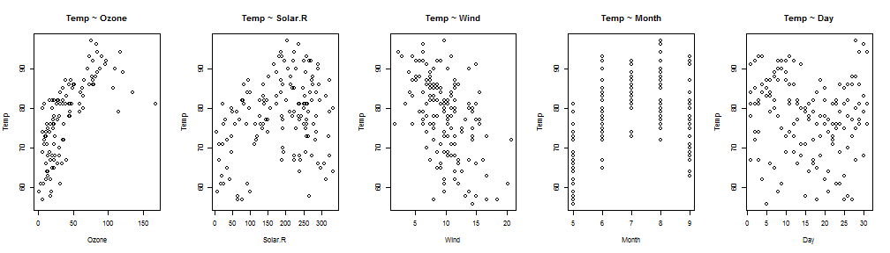

## Description

The Dataset used in this project contains daily air quality measurements in New York, May to September 1973.

```r
library(datasets)
head(airquality)
```

```
##   Ozone Solar.R Wind Temp Month Day
## 1    41     190  7.4   67     5   1
## 2    36     118  8.0   72     5   2
## 3    12     149 12.6   74     5   3
## 4    18     313 11.5   62     5   4
## 5    NA      NA 14.3   56     5   5
## 6    28      NA 14.9   66     5   6
```
The datatable shows 154 observations on 6 variables.

--- .class #id 

## Variables

*Variables tracked in the data table are explained below:*

-**Ozone**: Mean ozone in parts per billion from 1300 to 1500 hours at Roosevelt Island

-**Solar.R**: Solar radiation in Langleys in the frequency band 4000 to 7700 Angstroms from 0800 to 1200 hours at Central Park

-**Wind**: Average wind speed in miles per hour at 0700 and 1000 hours at LaGuardia Airport

-**Temp**: Maximum daily temperature in degrees Fahrenheit at La Guardia Airport.

-Also **Month** and **Day**.

*I will examine the relationship between each variable with the temperature of the day, using the shiny model: https://theabao.shinyapps.io/Shiny*

--- .class #id 

## Regression Model Plots

```r
data<-airquality
par(mfrow=c(1,5))
plot(Ozone, Temp, main="Temp ~ Ozone", )
plot(Solar.R, Temp, main="Temp ~ Solar.R")
plot(Wind, Temp, main="Temp ~ Wind")
plot(Month, Temp, main="Temp ~ Month")
plot(Day, Temp, main="Temp ~ Day")
```

 

--- .class #id 

## Results
 

Positively related variables with temperature: Ozone, Solar.R and Month;
negatively related variables with temperature: Wind and Day

The end.
--- .class #id 
